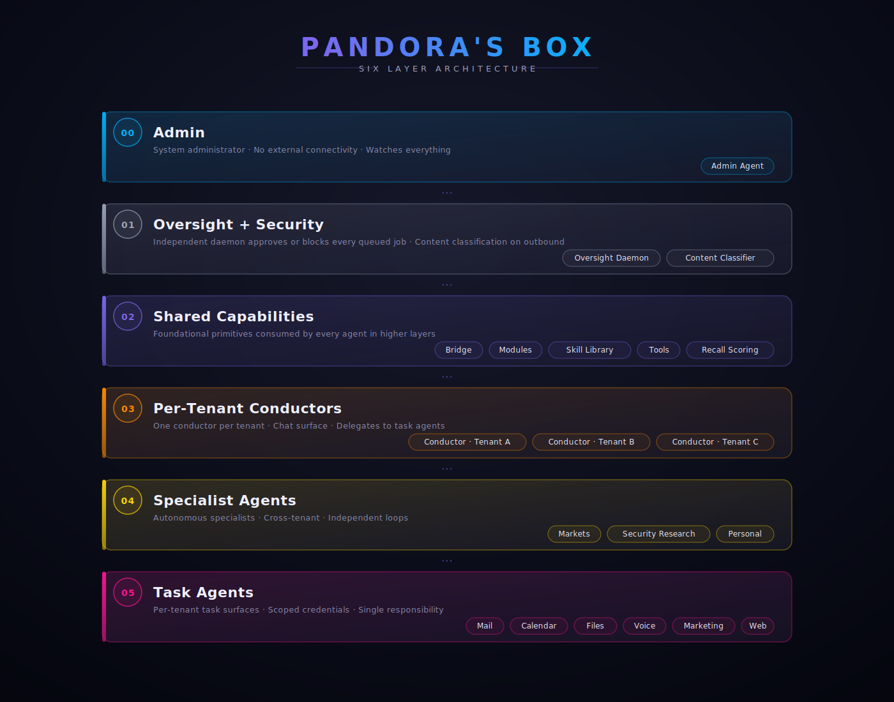

<!-- _A6_1_NARRATIVE_SCRUB_V1 -->
# Pandoras Box
<!-- _A1_COVER_PAGE_V1 -->

[](LICENSE)
[-brightgreen.svg)](https://www.debian.org)
[-yellow.svg)](https://apple.com/macos)
[](https://nodejs.org)
[](https://github.com/AI-PandorasBox/pandoras-box/releases)
[](https://github.com/AI-PandorasBox/pandoras-box/stargazers)

**Run your own AI ops team. On hardware you own.**

Pandoras Box turns a Mac mini or a Linux mini-PC into a self-hosted multi-agent AI platform. One installer, one machine, multiple AI assistants -- each scoped to a company or context, each isolated at the operating-system level. Every action is approved by an independent oversight daemon before it runs. You own the keys, you own the data, you own the audit trail.

Built for people who want production-grade AI assistants on hardware they control rather than cloud services they depend on. Today it handles email, calendar, documents, voice synthesis, and real-time voice calls for multiple separate companies from one box -- with zero cross-company data path.

**Project website + walkthrough:** [ai-pandorasbox.co.uk](https://ai-pandorasbox.co.uk)

### Who is this for?

- **Operators running multiple businesses or contexts.** Get one AI assistant per company, not one shared assistant that mixes their data.
- **People who want to OWN their AI stack.** No third-party data custody, no terms-of-service changes you didn't agree to. You sign in with your own Claude Pro or Max subscription, and bring your own keys for optional add-on services (Google, ElevenLabs, etc.), paying each provider directly.
- **Engineers who want a sandbox for agentic workflows.** Full source, Apache 2.0, modular install, hook-driven extensibility.

### How is this different?

- **vs. Claude.ai / ChatGPT:** Those are conversational. This is operational -- agents actually send mail, edit calendars, generate audio, on your behalf, under approval gates.
- **vs. Cursor / IDE assistants:** Those help you write code. This handles your inbox, your scheduling, your files, your voice work.
- **vs. cloud agent platforms (Lindy, Relevance, etc.):** Those host your agents on someone else's machine. Here, your agents live on your own box. The only cloud calls are the LLM/voice APIs you authorise.

> **Platforms:** **Linux** (Debian 13 / Ubuntu 24.04+, systemd) is the **verified** install path for this release -- tested end-to-end from a clean machine through to a working assistant. **macOS** (14+, Apple Silicon) is **beta**: the macOS install path ships and is supported, but is not yet verified end-to-end in this release, so expect rough edges and please report issues. One installer detects your OS and runs the right setup path. See the [Linux install guide](manuals/02b-installation-linux.md).

### Realistic costs

Claude reasoning runs on your **Claude Pro or Max subscription** -- a flat monthly fee, not pay-per-token. Pandoras Box doesn't bill you anything itself. Optional add-on services bill separately for what you use:

- **Claude (Pro or Max subscription):** flat monthly plan fee, regardless of how hard your agents work.
- **Optional add-ons** (Google AI, ElevenLabs, etc.): pay the provider directly for usage. A heavy daily-narration operator can hit $200+/month on ElevenLabs alone.

API-key (pay-per-token) Anthropic billing is not supported in this release; API support is planned for a future version. A built-in cost gate (`MAX_BUDGET_USD` per job, configurable) bounds add-on service spend.

---

## What ships (at a glance)

| Count | What |
|------:|------|
| **40** | installable modules (core + official tiers) |
| **15** | packaged skills (SKILL.md + code): 2 hand-built + 13 promoted from recipe specs via the skill promoter |
| **{{TOOL_COUNT}}** | tools (LLM-callable functions) in the shipped catalogue available to the assistant -- many require you to connect your own accounts/keys before they do anything |
| **12** | Personal AI capability surfaces (chat, summary, tasks, create, research, files, knowledge, contacts, calendar, email, call, camera) |
| **8** | connectors: Gmail, Microsoft 365, calendar, files, plus Telegram / Slack / Discord / WhatsApp relays |
| **3** | independent agent tiers (admin, oversight, per-company conductor + task agents) |
| **4** | platform layers shipped: security (oversight + content classifier), memory (history + recall + knowledge), self-improvement (weekly pipeline), and per-agent operating guides |

## Key Features

| | |
|---|---|
| **Browser-first Personal AI** | Full browser-app interface: chat with streaming replies, daily briefing, tasks, notes/drops, research, files, contacts, optional voice input and TTS. Reachable from your phone over Tailscale. |
| **An Admin agent that runs the platform** | A dedicated administrator agent oversees every service, runs gated deploy sessions, and holds the system dashboard. It works from an operating guide shipped with the install. |
| **Per-company agents, compartmentalised** | Each company gets its own assistant -- mail, calendar, files, voice -- isolated at the operating-system level. Separate user accounts, separate credentials, separate job queues, no cross-tenant data path. |
| **Security that acts, not just watches** | An independent oversight daemon approves every queued action before it runs. A local content-classifier sidecar scores outbound content. Failing agents are quarantined; a watchdog runs twice-daily integrity checks; dependencies are scanned weekly. Optional encrypted backups. |
| **Memory built for continuity** | Three working layers -- rolling history, semantic vector recall, and structured knowledge (notes, important facts, drops). On top, a self-improvement pipeline produces a weekly digest of suggested prompt improvements. Nothing self-applies without your approval. |
| **Specialised systems for real work** | Offline knowledge library (Wikipedia + reference packs). Media production pipeline (music + narration + image + video + YouTube). Trading research (paper). Asynchronous deep research. Local-model intent routing with frontier fallback. |

Read the full feature deep-dive at [ai-pandorasbox.co.uk](https://ai-pandorasbox.co.uk).

---


## Install

**Instant install (one command):**

```bash
bash <(curl -fsSL https://raw.githubusercontent.com/AI-PandorasBox/pandoras-box/main/install.sh)
```

**Safer alternative (review before running):**

```bash
curl -fsSL https://raw.githubusercontent.com/AI-PandorasBox/pandoras-box/main/install.sh -o install.sh
# Open install.sh in a text editor and review it
bash install.sh
```

**From a clone:**

```bash
git clone https://github.com/AI-PandorasBox/pandoras-box.git
cd pandoras-box
bash install.sh
```

### What the installer actually does

The installer is a guided shell script -- nothing happens silently. Expect roughly the following 10 steps over 15-30 minutes:

1. **Disclaimer + theme selection.** Branding, paths, log location.
2. **Prerequisites check.** macOS + Apple Silicon (or Debian 13+/Ubuntu 24.04+ with systemd on Linux), package manager, Node 22+, available disk.
3. **Claude credentials.** Subscription auth via `claude /login` (browser sign-in with your Claude Pro or Max account). Stored in the macOS Keychain (on Linux, an encrypted file under `/opt/pandoras-box/.secrets`). API-key billing is not supported in this release.
4. **Tailscale (optional).** Joins your private mesh so you can reach the Personal AI from your phone.
5. **Certificates.** Self-signed TLS for the loopback HTTPS surfaces.
6. **Company agents.** For each company you add: collects MS365 or Google OAuth creds, creates a service account, generates per-tenant plists, npm-installs the conductor + 4 task agents.
7. **Personal AI.** The browser-first owner-facing assistant (chat UI on `127.0.0.1:8800`).
8. **Optional modules.** Backups, Dashboard, Terminal, Docs server, Ollama, relays (Discord/Slack/WhatsApp), Voice, Trading research, Offline KB, Media production -- each opt-in.
9. **System verification.** Health-checks every installed service.
10. **Update-check LaunchAgent.** Weekly background poll for new releases (osascript notification when available).

Reversible: every module has its own `uninstall.sh`. Per-tenant data lives under `/opt/pandoras-box/<slug>/`; removing a company is a single `rm -rf` of that dir + a `launchctl unload` of its plists.

**Prerequisites (macOS):** macOS 14 or later, Node.js 20+, Homebrew, a Claude Pro or Max subscription.

**Prerequisites (Linux):** Debian 13 (Trixie) or Ubuntu 24.04 LTS or later with systemd, Node.js 20+, a `sudo` user, a Claude Pro or Max subscription. No Homebrew (the installer uses `apt`). Full-disk encryption (LUKS) is recommended and set at OS-install time. Full walkthrough: [manuals/02b-installation-linux.md](manuals/02b-installation-linux.md).

> **macOS pre-flight (do this first, not optional):** Before you run the installer, turn off iCloud Drive's **"Desktop & Documents Folders"** sync and **"Optimize Mac Storage"**. macOS can otherwise evict installed files to iCloud and replace them with placeholders, silently breaking every service that imports them and corrupting backups. See [docs/setup/icloud.md](docs/setup/icloud.md) for the full explanation and the verify command. This applies to Dropbox, OneDrive, Google Drive too — do not install Pandora's Box into any cloud-synced directory.

**You do not need to be technical.** Step 1 of the installer is to install Claude itself and brief it about your install. From that point on, if anything goes wrong on any later step, you press Return at the prompt and Claude reads the install log and tells you what to do next. No prior knowledge of macOS, Node, or shell scripting required.

**An API key is no longer needed up front.** The installer signs you into Claude in the browser the same way the Claude desktop app does. You only need to provide API keys later for *optional* paid services (Google AI for image/video, ElevenLabs for voice, Brave Search for web context, Suno for music) and the installer will tell you which.

**You will be asked to accept a no-liability disclaimer** before any install action. The installer requires you to type `yes` to acknowledge that AI agents take real-world actions on your behalf and you are responsible for them. Any other input exits cleanly without changing your machine.

See [docs/installation.md](docs/installation.md) for the full step-by-step guide and the [Installation Manual PDF](https://github.com/AI-PandorasBox/pandoras-box/releases/latest) for a printed reference.

---

## Architecture



Four tiers. A higher tier cannot be instructed by a lower one.

| Tier | Component | Role |
|------|-----------|------|
| **0** | The admin agent | System administrator. Command-line interface. No external connectivity. Manages infrastructure, deploys code, monitors services. |
| **1** | Argus | Independent oversight daemon. Approves or blocks every queued job. Cannot be instructed by any agent. Active blocking enabled by default. |
| **2** | Conductors | One per company. Receives owner messages, classifies intent, routes jobs to the queue. Holds no company credentials. |
| **3** | Task Agents | Mail, Calendar, Files, Voice -- one per function per company. Each holds only its own scoped credentials. Fully OS-isolated from other companies. |

A fifth component -- **the Personal AI** -- is the owner's personal AI interface: a browser-accessible assistant with a unified inbox, calendar view, daily briefing, research, and voice input, drawing on all company contexts simultaneously (read-only).

---

## Technical features in depth

**Tenant isolation.** Each company's agents run as a dedicated service account (macOS or Linux) with no shared credentials, no shared database, and no shared memory. OS-level `750` permissions enforce the boundary.

**Argus oversight.** Every job created by every agent passes through Argus before execution. Argus is a standalone daemon that no agent can instruct or reach. It blocks anomalous jobs, quarantines failing agents, and sends alerts.

**Browser-first Personal AI.** The owner's primary interface is a web app -- no Telegram required for personal use. Accessible over Tailscale or local network from any device. Unified inbox, calendar, daily briefing, research, voice, and more.

**Modular install.** Core system installs cleanly in 15 minutes. Optional modules (Discord relay, Watch companion, trading signals, social pipeline, local LLM, RAG knowledge base) install independently and are fully reversible.

**Local LLM option.** High-volume classification tasks run on a local Ollama instance using an open-weight model (default: gemma3:12b). This eliminates the most frequent API calls and significantly reduces operating costs.

**Self-improvement pipeline.** The Personal AI carries a built-in self-improvement cycle: session compression, skill library, weekly GEPA optimisation proposals, and user-pattern modelling -- all running on a schedule without manual intervention.

**Three-layer sanitization gate.** A local pre-commit hook, a local pre-push hook, and a server-side GitHub Actions workflow all independently scan for credential shapes before any code leaves your machine or lands on the default branch. Operator-specific patterns (your real name, paths, tenants) live ONLY at `~/.config/pandoras-box/sanitize-patterns` -- never inside the repo. The hooks refuse to run if the patterns file ever reappears at the repo root (gate-on-the-gate). See [SECURITY.md](SECURITY.md) for the threat model.

---

## Modules

| Module | Purpose | Description | Docs | Status |
|--------|---------|-------------|------|--------|
| **core** | Base system | admin agent, oversight, job queue, conductors, base task agents | [catalog](docs/modules.md#core) · [admin guide](manuals/03-admin-guide.md) · [architecture](docs/architecture.md) | Required |
| **personal-ai** | Personal AI assistant | Browser UI with unified inbox, calendar, briefing, and research | [catalog](docs/modules.md#personal-ai) · [user manual](manuals/05-personal-assistant-user-manual.md) | Recommended |
| **mail-ms365** | Microsoft email | Outlook/Exchange integration via Microsoft Graph API | [catalog](docs/modules.md#mail-ms365) · [agents guide](manuals/06-company-agents.md) | Optional |
| **mail-google** | Gmail | Gmail integration via Google OAuth | [catalog](docs/modules.md#mail-google) · [agents guide](manuals/06-company-agents.md) | Optional |
| **calendar** | Calendar sync | Calendar integration (auto-detects MS365 or Google) | [catalog](docs/modules.md#calendar) · [agents guide](manuals/06-company-agents.md) | Optional |
| **files** | Document access | SharePoint or Google Drive document retrieval | [catalog](docs/modules.md#files) · [agents guide](manuals/06-company-agents.md) | Optional |
| **voice-agent** | TTS + STT task agent | Per-tenant narration / transcription via ElevenLabs + Groq Whisper. Same canUseTool security envelope as mail/calendar/files. | [README](modules/voice-agent/README.md) | Optional |
| **voice-call** | Real-time voice call | Browser-default loopback HTTP+WSS daemon bridging mic audio to Gemini Live. Per-tenant voice + system prompt config. Conversation-only in v0.5.x. | [README](modules/voice-call/README.md) | Optional |
| **admin-lite** | Mobile admin | Mobile-friendly admin panel (Tailscale-accessible) | [catalog](docs/modules.md#admin-lite) · [admin guide](manuals/03-admin-guide.md) | Optional |
| **dashboard** | System monitor | Local service status and health dashboard | [catalog](docs/modules.md#dashboard) · [admin guide](manuals/03-admin-guide.md) | Optional |
| **terminal** | Web terminal | Browser-based terminal with authentication | [catalog](docs/modules.md#terminal) · [admin guide](manuals/03-admin-guide.md) | Optional |
| **docs-server** | Local docs | Local documentation server | [catalog](docs/modules.md#docs-server) · [admin guide](manuals/03-admin-guide.md) | Optional |
| **ollama** | Local LLM | On-device LLM for classification (recommended: gemma3:12b, 16GB RAM) | [catalog](docs/modules.md#ollama) · [module reference](manuals/07-module-reference.md#ollama) | Optional |
| **relay-discord** | Discord relay | Receive and reply to messages via Discord | [catalog](docs/modules.md#relay-discord) · [module reference](manuals/07-module-reference.md#relay-discord) | Optional |
| **relay-slack** | Slack relay | Receive and reply to messages via Slack | [catalog](docs/modules.md#relay-slack) · [module reference](manuals/07-module-reference.md#relay-slack) | Optional |
| **relay-whatsapp** | WhatsApp relay | WhatsApp relay (unofficial bridge -- see module README) | [catalog](docs/modules.md#relay-whatsapp) · [module reference](manuals/07-module-reference.md#relay-whatsapp) | Optional |
| **content-classifier** | Content classifier | Local 0.3B-parameter outbound-content safety scorer (shadow mode by default) | [README](modules/content-classifier/README.md) | Recommended |
| **admin-shell** | Chrome desktop admin app | Standalone Chrome window for the admin shell (alternative UX to admin-lite) | [README](modules/admin-shell/README.md) | Optional |
| **trading-research** | Trading bot | Autonomous trading signals (requires brokerage API credentials) | [catalog](docs/modules.md#trading-research) · [module reference](manuals/07-module-reference.md#trading-research) | Optional |
| **media-production** | Content pipeline | Social media and content publishing automation | [catalog](docs/modules.md#media-production) · [module reference](manuals/07-module-reference.md#media-production) | Optional |
| **offline-kb** | Knowledge base | Vector RAG store for document retrieval and Q&A | [catalog](docs/modules.md#offline-kb) · [module reference](manuals/07-module-reference.md#offline-kb) | Optional |
| **self-improvement** | Self-improvement | Agent self-analysis and prompt optimisation pipeline | [catalog](docs/modules.md#self-improvement) · [module reference](manuals/07-module-reference.md#self-improvement) | Optional |
| **video-publisher** | Video production | Automated video production and YouTube publishing | [catalog](docs/modules.md#video-publisher) · [module reference](manuals/07-module-reference.md#video-publisher) | Optional |
| **backups** | Encrypted offsite-ready backups | Daily age-encrypted tarball + Sunday freshness probe | [README](modules/backups/README.md) | Recommended |
| **personal-sensor** | Personal intelligence layer | Ambient sensor daemon + Watch companion (Wear OS) | [README](modules/personal-sensor/README.md) | Optional |
| **desktop-launchers** | Desktop shortcuts | .app / .desktop launchers for Dashboard / Terminal / Assistant | [README](modules/desktop-launchers/README.md) | Recommended |

Full module documentation: [docs/modules.md](docs/modules.md)

---

## Documentation

| Document | Description |
|----------|-------------|
| [Glossary](docs/GLOSSARY.md) | Canonical terms: module, skill, tool, agent, conductor — aligned to Claude's vocabulary |
| [Architecture](docs/architecture.md) | Four-tier design, security layers, component reference |
| [Security](docs/security.md) | Isolation model, oversight daemon design, threat model, automated defences |
| [Multi-Tenant Setup](docs/multi-tenant.md) | Running multiple companies on one machine |
| [Modules](docs/modules.md) | Complete module catalog with prerequisites |
| [Release process](docs/RELEASE-PROCESS.md) | How releases are built, signed, and verified |

**PDF Manuals** -- download from [GitHub Releases](https://github.com/AI-PandorasBox/pandoras-box/releases/latest):

| Manual | Description |
|--------|-------------|
| Getting Started | System overview, costs, and hardware requirements |
| Installation Guide | Step-by-step install with screenshots |
| System Administrator Guide | Service management, monitoring, projects |
| Security Guide | Threat model, incident response, architecture detail |
| Personal Assistant User Manual | Personal AI features: briefings, inbox, research, voice |
| Company Agents Guide | Mail, Calendar, Files agents, AaaS model |
| Module Reference | All modules with prerequisites and costs |
| Troubleshooting Guide | Symptom, cause, and fix for common issues |

---

## Contributing

See [CONTRIBUTING.md](CONTRIBUTING.md) for how to report bugs, submit pull requests, and contribute new modules.

Security issues: see [SECURITY.md](SECURITY.md). Do not report security vulnerabilities via public GitHub Issues.

---

## Disclaimer

This software is provided as-is under the Apache 2.0 License. See [DISCLAIMER.md](DISCLAIMER.md) for the full disclaimer covering AI output, API costs, security, and compliance responsibilities. By installing and running Pandoras Box you accept the terms in DISCLAIMER.md.

---

## License

Apache 2.0 -- see [LICENSE](LICENSE)
