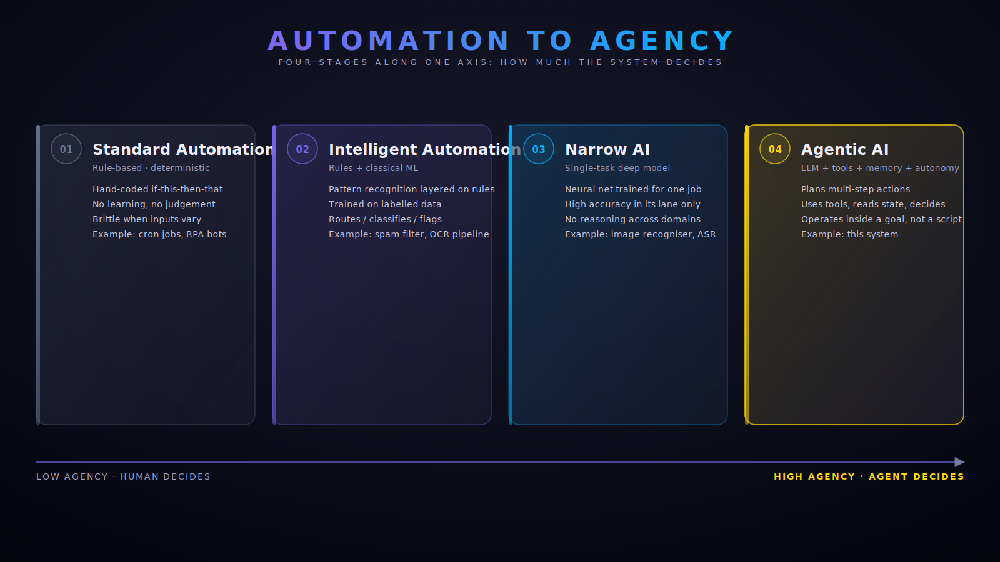
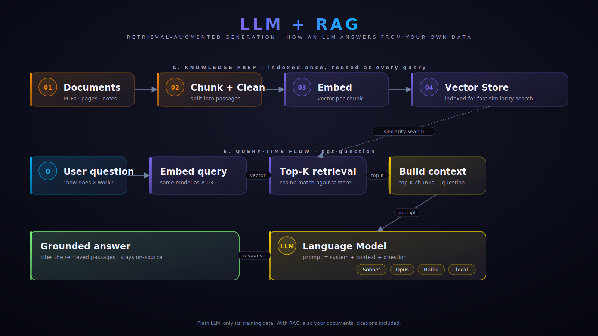
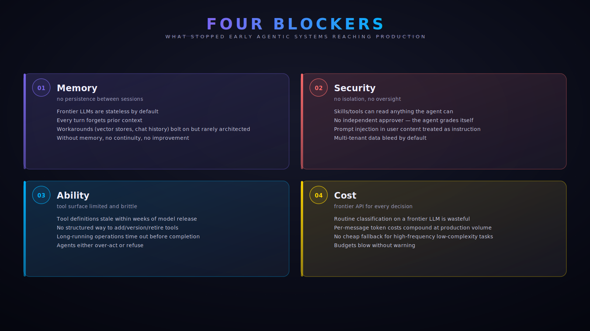
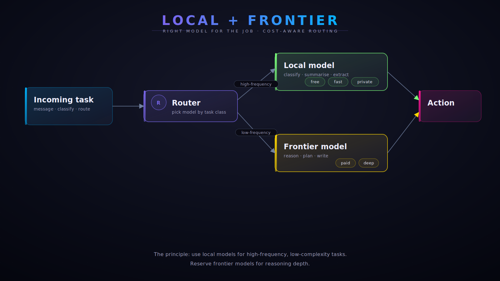
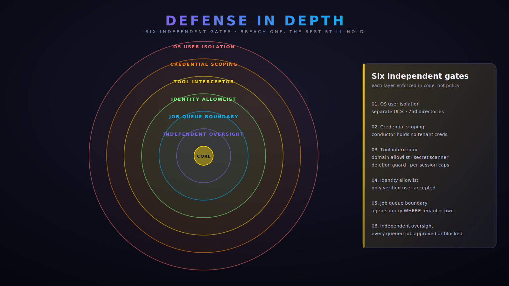

<!-- _A6_1_NARRATIVE_SCRUB_V1 -->
# Key Concepts

Short visual explainers for the ideas Pandoras Box is built on. Read alongside [`layers.md`](layers.md) for the architecture model and [`overview.md`](overview.md) for the high-level summary.

---

## Automation to Agency

The spectrum from rule-based automation to autonomous agents. Pandoras Box sits at the right end — language-model-driven agents that plan multi-step actions inside a stated goal.

---

## LLM + RAG

How a language model answers from your own documents. Knowledge is indexed once into a vector store; each question is matched to the most relevant passages and given to the LLM along with the prompt. Answers stay on-source and can cite the retrieved chunks.

---

## The four production blockers

Why earlier agentic systems struggled to reach production: stateless memory, ad-hoc security, brittle tool surfaces, and frontier-API cost for every routine decision. Pandoras Box addresses each by design.

---

## Local plus frontier models

Route by task class. Use small local models (free, fast, private) for high-frequency low-complexity work — classification, summarisation, extraction. Reserve frontier models for the reasoning that needs them.

---

## Defense in depth

Six independent gates between an external message and an executed action. Each layer is enforced in code, not by policy. Breach one, the others still hold.

