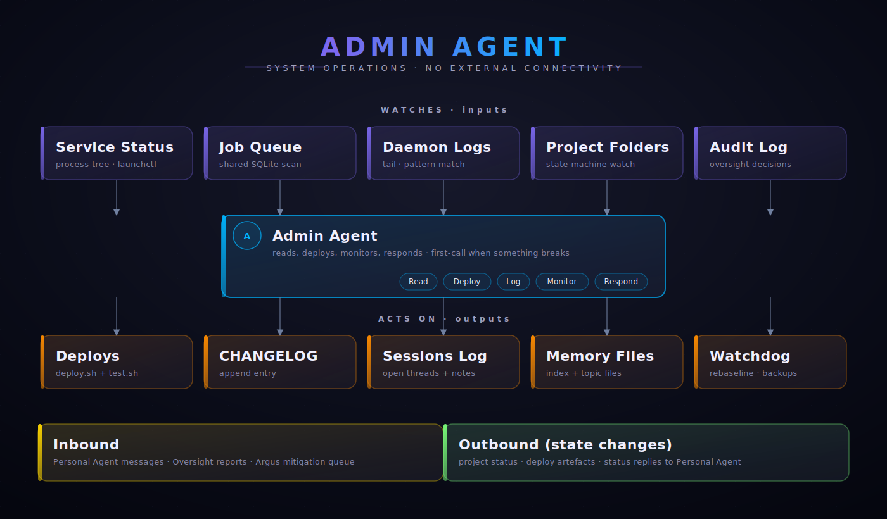
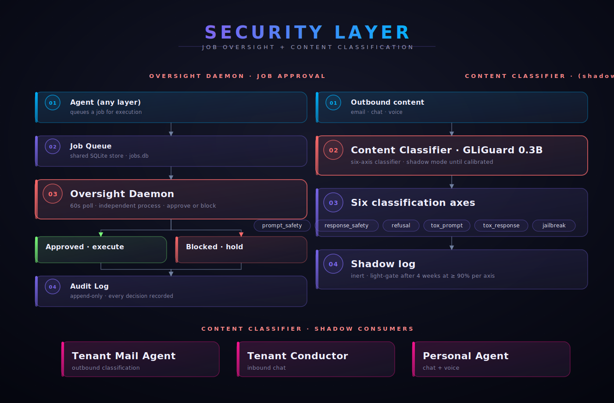
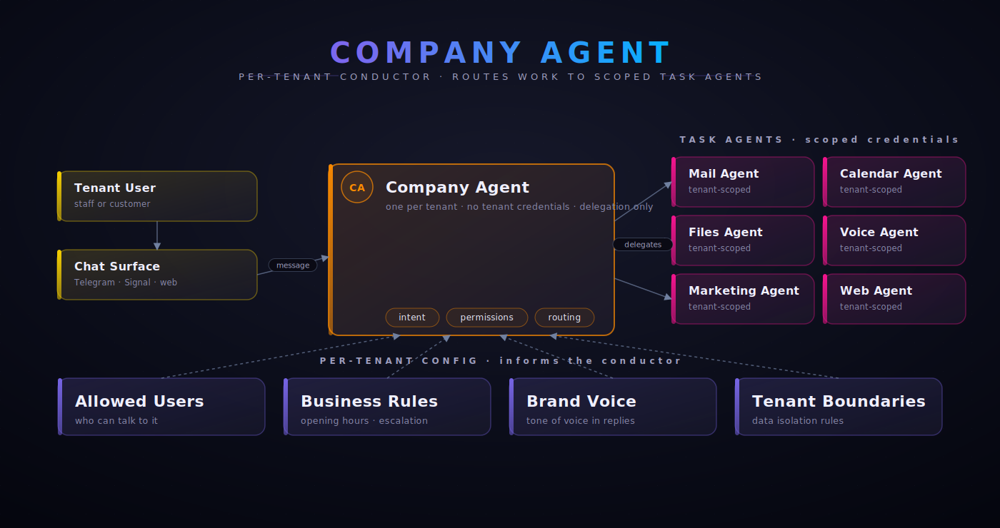
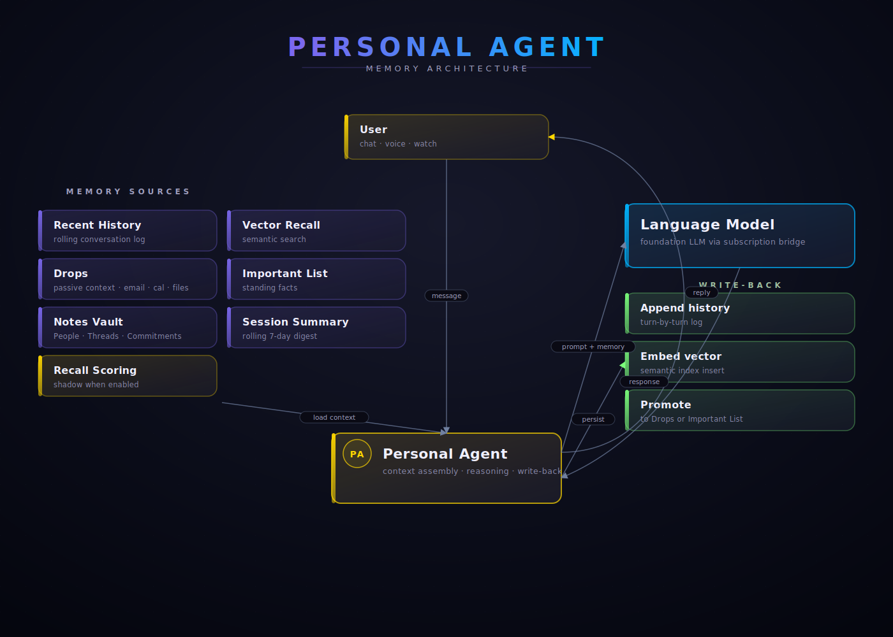
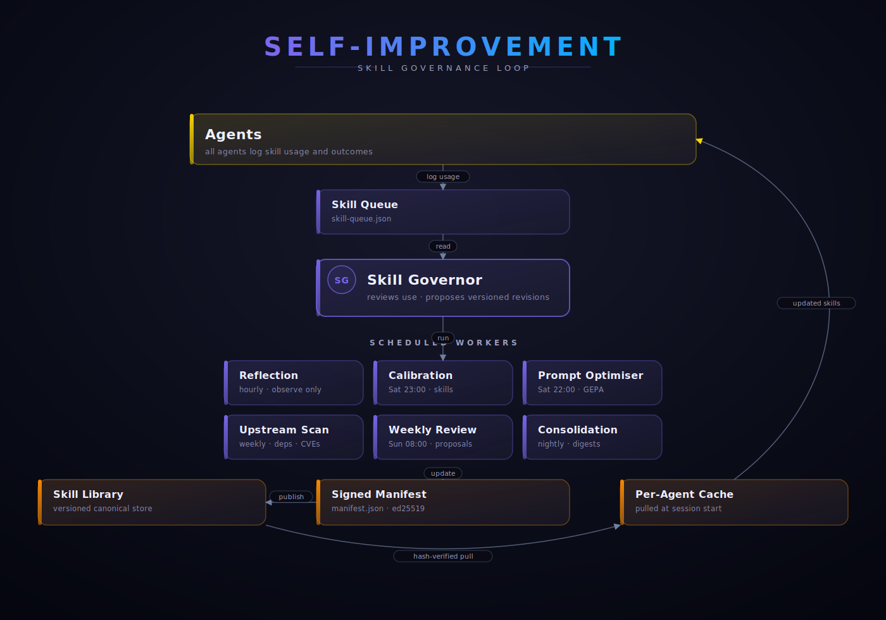

# Architecture Layer Model

<!-- _A4_ARCHITECTURE_DOCS_V1 -->

> Single source of truth for which layer a subsystem belongs to. Read this **before** placing anything in a docs tree, a dashboard panel, or any architecture diagram.

## 1. Why this exists

A multi-agent system grows by adding subsystems, and subsystems get placed where they were first wired — under the agent that first consumed them. That conflates **where it is wired** with **what it is**. Examples that have caught the project's maintainers:

- A scoring library that's agent-agnostic ends up nav-nested under the first agent that uses it.
- A production tool with its own daemon renders as a sub-tab of one agent.
- Foundational shared infrastructure (the bridge, the MCP servers, the module catalogue, the skill library) ends up with no nav presence at all.

This document fixes the mental model so subsequent nav, dashboard, and visualiser builds reflect architecture, not consumer history.

## 2. The six layers

### Layer 0 — Admin

Single occupant: **the admin agent** (display name depends on the theme pack chosen at install — Plain leaves it as "Admin"; theme packs supply their own role-name conventions). Runs under the operator's UID. No external connectivity by default. Builds and modifies the rest of the system at the operator's direction.

### Layer 1 — Oversight + Security daemons

Independent daemons that monitor or classify across the whole system. Peer to each other; never nested under any tenant or agent.

| System | Role | Sub-modules |
|---|---|---|
| **Argus** | Approves or blocks every queued job before execution. Cannot be instructed by any agent. | Talos (driver-session screener; runs inside `argus.mjs`, no separate daemon) |
| **the Content Classifier** | Content classifier sidecar. Screens outbound content across six axes (prompt safety, response safety, response refusal, prompt toxicity, response toxicity, jailbreak detection). | sidecar / panel / calibration |

### Layer 2 — Shared capabilities

Agent-agnostic infrastructure consumed by multiple agents. Lives at `/opt/pandoras-box/shared/` or has its own UID but operates cross-cutting. Sub-grouped by function for navigation.

| Group | Subsystem | Lives at |
|---|---|---|
| **Foundational** | Bridge (`anthropic-claude-adapter`) | `shared/anthropic-claude-adapter.mjs` |
| | MS365 MCP server | per-agent invocation |
| | Module Catalogue | `shared/catalogue/modules/` |
| | Skill Library | `shared/skills/` |
| **Scoring** | Kairos (temporal recall) | `shared/kairos-scoring.mjs` + memory schema |
| **Classification** | the Content Classifier tenant-rules library | `shared/content-classifier-tenant-rules.mjs` |
| **Modules** | mail / calendar / files / voice | `shared/modules/{...}` |
| | marketing (beta) | `shared/modules/marketing/` |
| | website-builder, video-publisher, etc. | `shared/modules/{...}` |
| **Production tools** | the Media Production Pipeline (content production pipeline) | `/opt/pandoras-box/media-production/` |
| | the Offline Knowledge Library (offline knowledge via Kiwix) | `/opt/pandoras-box/offline-kb/` |
| | Web Actions (Kourai Khryseai driver queue) | `/opt/pandoras-box/web-actions/` |
| | Daedalus (reviews and productions surface) | mnemosyne panel routes |
| **Self-improvement** | the Self-Improvement Pipeline umbrella | `/opt/pandoras-box/self-improvement/` |

the Self-Improvement Pipeline has sub-processes that operate on schedules:

| Sub-process | Schedule | Role |
|---|---|---|
| GEPA cycle | Saturday | Reviews the week's agent traces and proposes targeted improvements |
| Sunday review | Sunday | Generates the operator-facing digest of proposed changes |
| Upstream scanner | Friday | Polls Anthropic announcements + npm packages for changes the project should react to |
| Themis (Phase 2, calibrating) | Saturday | Grades candidate skill versions on a Pareto frontier |
| Reflexion (Phase 3, calibrating) | Hourly | Detects threshold-breach failure patterns and proposes micro-GEPA fixes |
| Morpheus (Phase 4, deferred) | Saturday | Memory consolidation via the self-hosted Dreams pattern |

### Layer 3 — Per-tenant conductors

Per-company orchestration. Each conductor handles intent classification and dispatch within one tenant. Holds zero tenant credentials directly — the Layer 5 task agents do.

The installer creates one conductor per business tenant you configure. Default install ships with one tenant; you can add more via `./install.sh --add-tenant` later. Each conductor runs under its own service account (`tenant-1-agent`, `tenant-2-agent`, etc.) with its own keychain and filesystem permissions.

### Layer 4 — Peer agents

Own UID, independent operation. Not nested under any tenant. Report findings cross-system but operate autonomously.

| Agent | Default domain | Status |
|---|---|---|
| Personal AI (theme name varies) | Cross-tenant orchestration, mobile interface, voice | Always installed |
| the Trading Research Agent (trading) | Algorithmic trading via IG.com API | Opt-in, disclaimer required |

The Personal AI has its own sub-components that are NOT separate layer-4 peers — they're conceptually parts of the Personal AI surface:

- **Voice call server** — WebRTC two-way audio
- **the Personal Sensor Layer (planned)** — ambient signal layer that feeds proactive cues into the Personal AI

### Layer 5 — Task agents

Per-tenant specialists. Hold scoped credentials only — their tenant's. Operate under their conductor.

For each business tenant, the default install includes:

| Task agent | What it does |
|---|---|
| `<tenant>-mail` | Microsoft 365 inbox triage, draft generation |
| `<tenant>-calendar` | Meeting scheduling, board-pack preparation |
| `<tenant>-files` | SharePoint / OneDrive document indexing and retrieval |
| `<tenant>-voice` | Text-to-speech for spoken agent responses (per-tenant voice) |

Optional add-ons per tenant:

| Optional task agent | What it does |
|---|---|
| `<tenant>-marketing` | Mailchimp / LinkedIn / Meta wrappers |
| `<tenant>-web` | Web design wizard |

Plus the Personal AI manages a small set of cross-tenant Microsoft 365 task agents under its own service account, for mailboxes the operator wants the Personal AI to read across (operator's personal inbox, shared mailboxes, etc.).

## 3. Placement rule (the decision tree)

For any new subsystem, ask in order:

1. Does it administer the system itself? → **Layer 0** (admin agent only)
2. Is it an independent daemon monitoring or classifying across all agents? → **Layer 1**
3. Does it live in `/opt/pandoras-box/shared/`? → **Layer 2** (pick the right group)
4. Does it have its own UID and operate autonomously across tenants? → **Layer 4** (peer agent)
5. Is it bound to one tenant and orchestrates dispatch within it? → **Layer 3** (conductor)
6. Is it a scoped specialist serving one tenant's data domain? → **Layer 5** (task agent)
7. Is it conceptually a personal surface of one peer agent? → **Layer 4 sub-component** (not its own layer)

If unclear, default to **Layer 2** (shared capability) with `consumed_by` arrows pointing to the first consumer. Promote to its own layer when independence becomes clear.

## 4. Cross-cutting "consumes" relationships

Each shared capability has a `consumed_by` list. Each consumer has a `depends_on` list. These cross-reference arrows let the visualiser render dependencies without duplicating tree nodes.

Examples:

- `Kairos.consumed_by` = [Personal AI]
- `Personal AI.depends_on` = [Bridge, MS365 MCP, Kairos, the Self-Improvement Pipeline, the Media Production Pipeline, the Offline Knowledge Library]
- `the Content Classifier tenant-rules.consumed_by` = [conductor email integrations, Personal AI chat + voice integrations]

## 5. How this document is consumed

- **Docs nav** — top-level groups follow the layer structure (Agents / Security / Infrastructure on the public side; layers 0-5 on the operator's internal docs).
- **Visualiser** — `/api/subsystems-hierarchy` returns this tree as JSON.
- **Dashboard** — surfaces a hierarchy panel reading from the visualiser endpoint.
- **Architecture overview** — references the layer model in its diagrams.

## 6. Layer diagrams

The following diagrams show each part of the system in detail. All rendered from the canonical layer model — edit the source at `subsystems-hierarchy.mjs` and the diagrams update.

### Admin Agent — system operations (Layer 0)

### Oversight + Security (Layer 1)

### Per-Tenant Conductor (Layer 3)

### Personal Agent · Memory (Layer 4 example)

### Self-Improvement loop

## 7. Living document

Whenever a new subsystem is added (a project deploys a new daemon or a new shared lib), the operator appends to the inventory in this document as part of the same deploy. If the layer is ambiguous, default to Layer 2 (shared capability) and reclassify when independence becomes clear. A new subsystem never lives unclassified.

## Reference

- [Architecture overview](overview.md)
- [Service dependencies](dependencies.md)
- [Recovery runbook](recovery.md)
- [Security model](../security.md)
- [Multi-tenant isolation](../multi-tenant.md)
