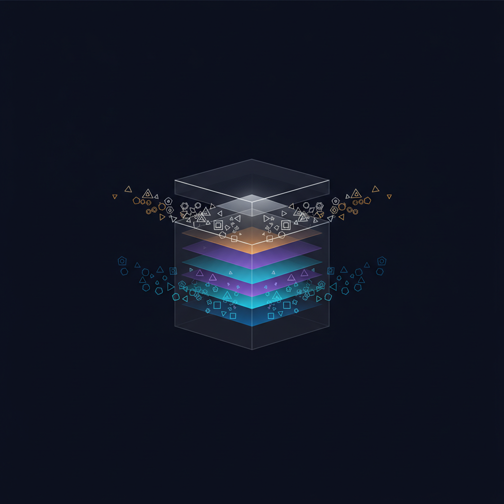

<!-- _A6_1_NARRATIVE_SCRUB_V1 -->
# Pandora's Box — Long-form Overview

<!-- _A1_COVER_PAGE_V1 _A4_ARCHITECTURE_DOCS_V1 -->



**Open-source multi-agent AI infrastructure for the machine you own.** Linux (Debian 13 / Ubuntu 24.04+) is the verified install path; macOS (14+, Apple Silicon) ships as beta. This document is the long-form companion to the [README](../README.md). It explains what the system is, why each part exists, and what running it actually looks like.

---

## What it is

Pandora's Box runs multiple AI assistants simultaneously on a single box (a Linux mini-PC or a Mac mini), with strict OS-level isolation between them, an independent oversight daemon that approves every action, and a browser-first personal AI interface for the operator. It is built for people who want production-grade AI assistants on hardware they own, not cloud services they depend on.

The system is designed to handle real operations: mail, calendar, documents, voice, and content production for multiple separate contexts (e.g. several small businesses, plus personal life) from one machine, without cross-context data exposure.

## Why use it

- **One subscription, many agents.** Every Claude call routes through a per-session bridge that uses your Claude Pro or Max subscription. No per-call API charges. No surprise bills. One subscription powers your admin agent, your personal AI, and every business agent.
- **Hardware you own.** The system runs on a mini-PC in your office (Linux or Mac). Nothing leaves the machine except calls to the LLM providers you have explicitly configured. Your memory, your files, your customer data — local.
- **OS-level isolation between tenants.** Each business context runs under its own macOS service account with its own keychain, its own credentials, its own filesystem permissions. The hospitality agent cannot see the IT agent's customer database, even when both are running on the same Mac.
- **Independent oversight.** An oversight daemon called Argus approves every queued job before it executes. A content classifier called the Content Classifier screens outbound content. Both run independently of the agents they watch.
- **Self-improving.** A scheduled self-improvement pipeline (the Self-Improvement Pipeline) reviews agent traces weekly and proposes targeted improvements. Operator approves before any proposal lands.
- **Open and inspectable.** Source available under Apache 2.0. Every action logged. Every prompt visible. No vendor lock-in.

## Deployment tiers

The installer offers four tiers at setup time. Each adds capability without restructuring what's already running.

### Solo personal

One admin agent, one personal AI. No business tenants. Useful if you want a private daily-driver assistant with strong memory and a mobile interface, nothing else.

### Single business

Default. One admin agent, one personal AI, one business tenant (conductor plus four task agents: mail, calendar, files, voice). Most operators start here.

### Multi-business

One admin agent, one personal AI, N business tenants (specify N at install). Each tenant is fully isolated. Operators running several small businesses use this.

### Custom

Interactive picker. Choose exactly which agents, modules, and add-ons to install. For operators who know what they want.

## Framework primitives

The substrate every agent runs on. These six components are what differentiates Pandora's Box from a thin LLM-call wrapper.

### Bridge — Claude CLI wrapper

Every Claude API call routes through a per-session subprocess that wraps the Anthropic SDK and uses your Claude Pro or Max subscription's session cookie. No API key required; no per-call billing. (API-key, pay-per-token billing is not supported in this release; API support is planned for a future version.) The bridge maintains a stable session per conversation so context-window use is efficient and prompt-cache hits are amortised across the agents that share a tenant.

Anthropic has announced billing-model changes taking effect approximately 15 June 2026 that are expected to extend subscription-eligible functionality further. The bridge will publish a migration script under `scripts/migrate-anthropic-2026-06.sh` when those changes ship. See `docs/setup/anthropic.md` for details.

### Memory — temporal recall

Agents do not forget. Every memory write goes through a three-tier recall system: full-text search (BM25) for keyword matches, a vector index for semantic similarity, and a LIKE fallback for partial matches. A temporal scoring layer composes recency, frequency, importance, and validity into a single composite score — answering "what is the right memory for this moment", not just "what is most similar".

Memories carry validity windows (`valid_at` / `invalid_at`). When an agent learns that a fact has changed, the old row is marked invalid rather than deleted, preserving audit history while keeping the live view clean. Conflict resolution defers to explicit operator-marked supersessions — agents don't silently overwrite history.

### Security — Argus, the Content Classifier, tenant rules

Three independent layers.

**Argus** is the oversight daemon. It reads every queued job from the shared job queue before execution, classifies it against an event taxonomy, and approves or blocks. Cannot be instructed by any agent. Runs under its own service account with read access to all agents' logs but no write access to anything except its own state.

**the Content Classifier** is a content classifier sidecar. It runs a small (0.3B-parameter) language model that screens outbound content across six axes (prompt safety, response safety, response refusal, prompt toxicity, response toxicity, jailbreak detection). Light-gate mode is opt-in per tenant. Shadow mode runs by default for the first four weeks so operators can calibrate before enabling enforcement.

**Tenant rules** are per-tenant regex rules layered after the Content Classifier classification. Operators write Markdown rule files (`triage-rules-<tenant>.md`) that catch tenant-specific patterns the Content Classifier alone wouldn't.

### Self-improvement — the Self-Improvement Pipeline umbrella

the Self-Improvement Pipeline is a self-improvement umbrella that runs four sub-processes:

- **GEPA cycle** — every Saturday, the Self-Improvement Pipeline reviews the week's agent traces and proposes targeted improvements (prompt refinements, new heuristics, skill candidates).
- **Sunday review** — every Sunday, the operator receives a digest of proposed changes for approval. Nothing lands without operator sign-off.
- **Upstream scanner** — a weekly poll of Anthropic announcements + npm packages for changes the project should react to.

_(A grading layer that scores candidate skill versions on a Pareto frontier, and an hourly reflexion pass that reacts to failure patterns, are on the roadmap. The shipped pipeline is the deterministic, operator-gated weekly digest.)_

### Modular system — module catalogue and skill library

The module catalogue at `shared/catalogue/modules/` is a YAML registry of pluggable capability packs. Each module declares its name, status (live / beta / planned), dependencies, and the agents that can consume it. Operators enable capabilities per agent from the per-agent card in the dashboard, which toggles entries in the activation matrix (`agent-activation.json`). <!-- {{VERIFY-ACTIVATION}}: confirm the per-agent card UI is the shipped enable/disable surface before release. -->

The skill library at `shared/skills/library/` is a versioned canonical store of reusable skills (in Anthropic's SKILL.md format). Each skill is hash-verified at agent session start. The first migrated skill is `build_board_pack_from_calendar` — generates a board-pack PDF from a calendar week of events plus attached materials.

### Driver queue — browser automation

The browser-actions module gives agents an interactive browser surface (navigate / read / click / type / screenshot) via a local headless Chromium. Every action is token-gated, navigation is screened against a domain allowlist, and everything is audited. No agent can drive a browser unilaterally.

## Functional capabilities

What the framework lets you actually do. Each capability is a module the installer can enable per tenant.

### Communication

- **Mail** — Microsoft 365 inbox triage, draft generation, send confirmation gating.
- **Calendar** — meeting scheduling, board-pack preparation, conflict detection.
- **Files** — SharePoint document indexing, retrieval, attachment handling.
- **Voice** — ElevenLabs voice synthesis for spoken responses; voice call server for two-way phone audio.

### Production

- **the Media Production Pipeline** — content production building blocks. PRS-free music composition, ElevenLabs voice narration, AI image generation via Imagen (with your own key), and YouTube publishing automation. (Automated video assembly/generation is planned, not shipped in this release.)
- **Publishing toolchain** — an optional publishing-side toolchain that consumes the Media Production Pipeline outputs to produce books, audiobooks, and adapted video content.

### Marketing (beta)

- **Mailchimp wrapper** — campaign drafting, audience segmentation, send approval gating.
- **LinkedIn wrapper** — post drafting, engagement tracking.
- **Meta wrapper** — Instagram and Facebook draft generation.

The marketing module is beta because it's only been tested against one tenant's data shape. Operators should expect rough edges and validate every output before approving.

### Knowledge

- **the Offline Knowledge Library** — offline knowledge base. Kiwix-hosted Wikipedia plus other Kiwix archives, served locally so agents can research without external HTTP calls.
- **Vault graph** — knowledge graph of entities and relationships, extracted from agent conversations and document analysis. Surfaces in the Personal AI UI under the ambient-signals tab.
- **Web research** — agents can request research jobs; the Media Production Pipeline or Brave Search handles retrieval.

### Brand work

- **Brand sweep skill** — automated brand audit. Generates a multi-page PDF with logo provenance, typography, colour palette, messaging tone audit, social-handle availability, and trademark search. Reusable across tenants.

### Trading (disclaimer required)

- **the Trading Research Agent** — IG.com algorithmic trading agent. Demo mode by default. Live trading requires explicit environment variable override. See `docs/setup/ig-trading.md` for the full disclaimer.

### Vision

- **Live-stream-vision** — Gemini frame analysis. The operator's browser-tab content is streamed to Gemini in real time so agents can answer "what is on my screen right now".

### Document generation

- **Presentation pipeline** — full-bleed Chrome-headless rendering, branded slide layouts, exports to PPTX. Themes: dark, light, corporate, Google, gradient.
- **PDF generation** — board packs, brand audits, weekly reports, contracts.
- **Word documents** — DOCX export for letters, proposals, drafts.

### Automation

- **Browser actions** — interactive browser automation via a local headless Chromium, token + domain-allowlist gated and audited.
- **Cross-tenant orchestration** — the personal AI can read across all tenants for the operator while keeping the tenants isolated from each other.

## Naming themes

The installer offers seven themed name packs at setup time, plus a plain default. Each pack names four user-facing roles (admin agent, personal AI, security overseer, alert relay). Internal modules (Argus, the Content Classifier, etc.) keep their canonical names regardless of theme — they are technical components, not personas.

| Pack | Admin | Personal AI | Security overseer | Alert relay |
|---|---|---|---|---|
| Indian (Hindu) | Indra | Saraswati | Yama | Narada |
| Norse | Odin | Frigg | Heimdall | Hermod |
| Roman | Jupiter | Minerva | Janus | Mercury |
| Egyptian | Ra | Thoth | Anubis | Hermes-Trismegistus |
| Japanese (Shinto) | Amaterasu | Benzaiten | Tsukuyomi | Hachiman |
| Yoruba (Orisha) | Olodumare | Yemoja | Obatala | Eshu |
| Mesopotamian | Anu | Enki | Marduk | Nabu |
| Plain | Admin | Assistant | Oversight | Relay |

The "plain" pack is the default. It uses role labels instead of mythological names — useful if you find named-deity agents distracting or culturally inappropriate for your context.

## Quick start

Three options.

### One-liner install (fastest)

```
bash <(curl -fsSL https://raw.githubusercontent.com/AI-PandorasBox/pandoras-box/main/install.sh)
```

This downloads the installer, verifies its SHA-256 checksum against the latest release, and walks you through the six setup steps interactively.

### Cloned-repo install (safest)

```
git clone https://github.com/AI-PandorasBox/pandoras-box.git
cd pandoras-box
less install.sh        # review before running
bash install.sh
```

Recommended if you want to read the installer before it runs.

### Brewfile

The installer can pre-install macOS dependencies (Node, sqlite, ffmpeg, Docker, Obsidian, Tailscale) via Homebrew. The repo includes a `Brewfile` for that. Run `brew bundle install --file=Brewfile` if you'd prefer to handle dependencies separately.

## Documentation

| Topic | Path |
|---|---|
| Architecture | [docs/architecture/](architecture/README.md) |
| Module catalogue | [docs/modules.md](modules.md) |
| Multi-tenant isolation | [docs/multi-tenant.md](multi-tenant.md) |
| Security model | [docs/security.md](security.md) |
| Setup — overview | [docs/setup/overview.md](setup/overview.md) |
| Setup — Anthropic auth | [docs/setup/anthropic.md](setup/anthropic.md) |
| Setup — Microsoft 365 | [docs/setup/ms365.md](setup/ms365.md) |
| Setup — Tailscale mobile access | [docs/setup/tailscale.md](setup/tailscale.md) |
| Setup — Obsidian vault graph | [docs/setup/obsidian.md](setup/obsidian.md) |
| Setup — Docker (for the Offline Knowledge Library) | [docs/setup/docker.md](setup/docker.md) |

Setup guides for ElevenLabs, Google AI, YouTube OAuth, and IG.com trading also live under `docs/setup/`.

## Support

Pandora's Box ships with no commitment to support, bug fixes, security patches, or continued maintenance. The maintainers run this on their own hardware for their own use and publish it because others may find it useful.

If you find a bug, open a GitHub Issue. If you want a feature, open a Discussion. If you want priority support or a custom integration, the project is not currently a vehicle for that — fork the repo and adapt it to your needs under the terms of the licence.

## License and disclaimer

Source code: Apache License 2.0. See [LICENSE](../LICENSE).

The "Pandora's Box" name and any project logo or wordmark imagery are trademarks. See [TRADEMARK.md](../TRADEMARK.md).

Operators of the software accept full responsibility for what the software does on their behalf. See [DISCLAIMER.md](../DISCLAIMER.md). The maintainers accept no liability for any loss, damage, financial cost, security breach, missed obligation, or other consequence arising from use of the software.

## Support the project

If Pandora's Box is useful to you and you want to support continued development:

- ❤️ **PayPal donation** — `paypal.com/donate` (GBP) — the donate button in the GitHub repo sidebar routes here.
- ⭐ **Star the repo on GitHub** — visibility helps other operators find it.
- 🐛 **Report bugs you hit** — GitHub Issues. Sanitised log excerpts welcome; please remove personal data before posting.

The project has no commercial entity behind it at present. Donations support hardware, API costs for development, and the maintainers' time. There is no paid tier, no expectation of return, and no obligation on the maintainers to act on any feature requests.

---

*Last updated: 2026-05-16.*
